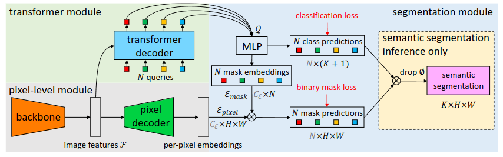

# MaskFormer: Per-Pixel Classification is Not All You Need for Semantic Segmentation

This repository contains the implementation of [Per-Pixel Classification is Not All You Need for Semantic Segmentation](https://arxiv.org/pdf/2107.06278.pdf)



## Description

Mask2Former, a universal architecture based on MaskFormer meta-architecture that achieves SOTA on panoptic, instance and semantic segmentation across four popular datasets (ADE20K, Cityscapes, COCO, Mapillary Vistas).

MaskFormer transforms any per-pixel classification model into a mask classification method. It utilizes a Transformer decoder to compute a set of pairs, each comprising a class prediction and a mask embedding vector. The binary mask prediction is obtained via a dot product between the mask embedding vector and per-pixel embedding from a fully-convolutional network. This model addresses both semantic and instance-level segmentation tasks without requiring changes to the model, losses, or training procedure. For both semantic and panoptic segmentation tasks, MaskFormer is supervised using the same per-pixel binary mask loss and a single classification loss per mask. A straightforward inference strategy is designed to convert MaskFormer outputs into a task-dependent prediction format.

# Getting Started! 

### Environment Creation
Create and activate a new conda environment to isolate the project dependencies:
```
conda create -n tfmaskformer
conda activate tfmaskformer
pip install -r /models/official/requirements.txt
pip install tensorflow-text-nightly
```

## Training 
Within the scripts folder you can find the training and evaluation scripts for different compute platforms (CPU/GPU/TPU).  *Remember to load the correct modules as required by each compute platform!*

To train the model on a GPU, you can use the provided shell script:
```
bash scripts/train_gpu.sh
```

Alternatively, you can manually set the environment variables and start training as follows:
```
export PYTHONPATH=$PYTHONPATH:{}
export RESNET_CKPT={}
export TFRECORDS_DIR={}
export MODEL_DIR={}
export TRAIN_BATCH_SIZE={}
export EVAL_BATCH_SIZE={}

export ON_TPU=False

export BASE_LR=0.0001
export IMG_SIZE=640
export NO_OBJ_CLS_WEIGHT=0.01

export DEEP_SUPERVISION=True

export OVERRIDES="runtime.distribution_strategy=one_device,runtime.num_gpus=1,runtime.mixed_precision_dtype=float32,\
task.train_data.global_batch_size=$train_bsize,\
task.model.which_pixel_decoder=transformer_fpn,\
task.init_checkpoint=$RESNET_CKPT"
python3 train.py \
  --experiment maskformer_coco_panoptic \
  --mode train \
  --model_dir $MODEL_DIR \
  --params_override=$OVERRIDES
```

## Evaluation 
For evaluating the model:
```
bash scripts/eval_gpu.sh
```

Or you can set the environment variables manually as shown:
```
export PYTHONPATH=$PYTHONPATH:{}
export MODEL_DIR={}
export MASKFORMER_CKPT={}
export RESNET_CKPT={}
export TFRECORDS_DIR={}

export TRAIN_BATCH_SIZE={}
export EVAL_BATCH_SIZE={}

export ON_TPU=False

export BASE_LR=0.0001
export IMG_SIZE=640
export NO_OBJ_CLS_WEIGHT=0.01

export DEEP_SUPERVISION=True

export OVERRIDES="runtime.distribution_strategy=one_device,runtime.mixed_precision_dtype=float32,\
task.validation_data.global_batch_size=$EVAL_BATCH_SIZE,task.model.which_pixel_decoder=transformer_fpn,\
task.init_checkpoint_modules=all,\
task.init_checkpoint=$MASKFORMER_CKPT"
python3 train.py \
  --experiment maskformer_coco_panoptic \
  --mode eval \
  --model_dir $MODEL_DIR \
  --params_override=$OVERRIDES
```


## Authors

* Wenxin Jiang ([@GitHub wenxin-jiang](https://github.com/wenxin-jiang))
* Vishal Purohit ([@GitHub Vishal-S-P](https://github.com/Vishal-S-P))


## Requirements 
[](https://github.com/tensorflow/tensorflow/releases/tag/v2.11.0)
[](https://www.python.org/downloads/release/python-390/)

## Citation 

```
@article{DBLP:journals/corr/abs-2107-06278,
  author       = {Bowen Cheng and
                  Alexander G. Schwing and
                  Alexander Kirillov},
  title        = {Per-Pixel Classification is Not All You Need for Semantic Segmentation},
  journal      = {CoRR},
  volume       = {abs/2107.06278},
  year         = {2021},
  url          = {https://arxiv.org/abs/2107.06278},
  eprinttype    = {arXiv},
  eprint       = {2107.06278},
  timestamp    = {Wed, 21 Jul 2021 15:55:35 +0200},
  biburl       = {https://dblp.org/rec/journals/corr/abs-2107-06278.bib},
  bibsource    = {dblp computer science bibliography, https://dblp.org}
}
```