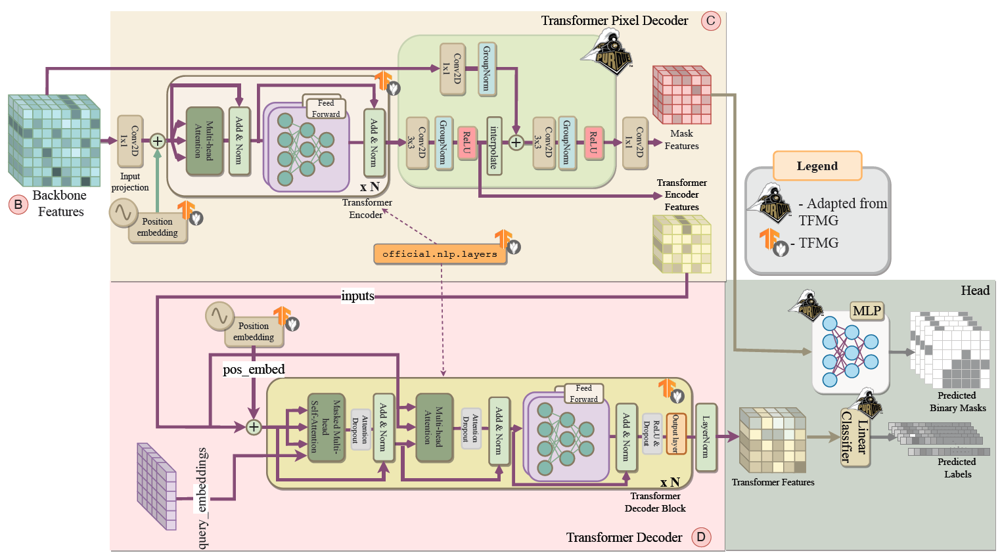

# A Partial Replication of MaskFormer for TPUs

This repository contains the re-implementation of [Per-Pixel Classification is Not All You Need for Semantic Segmentation](https://arxiv.org/pdf/2107.06278.pdf) for TPUs


## Table of Contents

1. [Description](#description)
2. [Getting Started](#getting-started)
    - [Requirements](#requirements)
    - [Environment Creation](#environment-creation)
    - [COCO Dataset to TFRecord Conversion Guide](#coco-dataset-to-tfrecord-conversion-guide)
        - [Overview](#overview)
        - [Running the Script](#running-the-script)
        - [Important Options](#important-options)
    - [Example Scripts](#example-scripts)
    - [Working with TPUs](#working-with-tpus)
        - [Environment Variables](#environment-variables)
        - [Training](#training)
        - [Evaluation](#evaluation)
3. [Authors](#authors)
4. [Citation](#citation)


## Description

MaskFormer, a universal architecture based on MaskFormer meta-architecture that achieves SOTA on panoptic, instance and semantic segmentation across four popular datasets (ADE20K, Cityscapes, COCO, Mapillary Vistas).

MaskFormer transforms any per-pixel classification model into a mask classification method. It utilizes a Transformer decoder to compute a set of pairs, each comprising a class prediction and a mask embedding vector. The binary mask prediction is obtained via a dot product between the mask embedding vector and per-pixel embedding from a fully-convolutional network. This model addresses both semantic and instance-level segmentation tasks without requiring changes to the model, losses, or training procedure. For both semantic and panoptic segmentation tasks, MaskFormer is supervised using the same per-pixel binary mask loss and a single classification loss per mask. A straightforward inference strategy is designed to convert MaskFormer outputs into a task-dependent prediction format.


# Getting Started

## Requirements 
[](https://github.com/tensorflow/tensorflow/releases/tag/v2.11.0)
[](https://www.python.org/downloads/release/python-390/)

## Environment Creation
Create and activate a new conda environment to isolate the project dependencies:
```
conda create -n tfmaskformer
conda activate tfmaskformer
pip install -r /official/requirements.txt
pip install tensorflow-text-nightly
```

## COCO Dataset to TFRecord Conversion Guide

Below are detailed instructions on how to convert the COCO dataset annotations and images into TensorFlow's TFRecord format using the `create_coco_tf_record.py` script. 

### Overview

The `create_coco_tf_record.py` script processes raw COCO dataset files, including images and their annotations (object annotations, panoptic annotations, and captions), and encodes them into TFRecord files. Each image and its corresponding annotations are encapsulated in a `tf.Example` protobuf message, serialized, and written to a TFRecord file.

To use this script, ensure you have the following COCO dataset files:
- **Images Directory**: For example, `train2017/`
- **Annotations Files**: Such as `instances_train2017.json`, `captions_train2017.json`, `panoptic_train2017.json`
- **Panoptic Masks Directory** (if using panoptic segmentation): Typically named similar to `train2017/`

### Running the Script

Use the following command template to run the conversion script. Make sure to adjust the paths and filenames to match your dataset's location and your specific requirements:

```bash
python create_coco_tf_record.py \
    --image_dir="/path/to/coco/images/train2017" \
    --object_annotations_file="/path/to/coco/annotations/instances_train2017.json" \
    --caption_annotations_file="/path/to/coco/annotations/captions_train2017.json" \
    --panoptic_annotations_file="/path/to/coco/annotations/panoptic_train2017.json" \
    --panoptic_masks_dir="/path/to/coco/panoptic_masks/train2017" \
    --include_masks=True \
    --include_panoptic_masks=True \
    --output_file_prefix="/path/to/output/tfrecords/train" \
    --num_shards=100
```

Replace `/path/to/` with the actual paths where your COCO dataset images and annotations are stored. The `output_file_prefix` flag specifies the output directory and filename prefix for the generated TFRecord files, while the `num_shards` flag indicates how many shard files to create for the dataset.

### Important Options

- **Include Masks**: Set `--include_masks=True` to include instance segmentation masks in the TFRecords. 
- **Include Panoptic Masks**: Use `--include_panoptic_masks=True` for panoptic segmentation tasks, which require both instance and semantic segmentation data.
- **Sharding**: Splitting the dataset into multiple shards (`--num_shards`) can significantly improve data loading efficiency during model training.
- **Panoptic Annotations**: For panoptic segmentation, both `--panoptic_annotations_file` and `--panoptic_masks_dir` must be specified.


## Example Scripts 
After completing the above steps, you can get started with training your model! Within the scripts folder you can find the training and evaluation scripts for different compute platforms (CPU/GPU/TPU).  
*Remember to load the correct modules as required by each compute platform!*

```
scripts/
  eval_gpu.sh
  eval_tpu.sh
  train_gpu.sh
  train_tpu.sh
```

## (Recommended) Working with TPUs

### Environemnt Variables 
Manually set the environment variables as follows:
```
export PYTHONPATH=$PYTHONPATH:~/models
export RESNET_CKPT={}
export MODEL_DIR={} # filepath to store logs
export TRAIN_BATCH_SIZE={}
export EVAL_BATCH_SIZE={}

export TPU_NAME={}
export TPU_SOFTWARE={}
export TPU_PROJECT={}
export TPU_ZONE={}
export TFRECORDS_DIR={} # .tfrecord datafolder

export ON_TPU=True 

export BASE_LR=0.0001
export IMG_SIZE=640
export NO_OBJ_CLS_WEIGHT=0.001

export DEEP_SUPERVISION=False 
```

### Training 
```
export OVERRIDES="runtime.distribution_strategy=tpu,runtime.mixed_precision_dtype=float32,\
task.train_data.global_batch_size=$TRAIN_BATCH_SIZE,\
task.model.which_pixel_decoder=transformer_fpn,\
task.init_checkpoint=$RESNET_CKPT"
python3 models/official/projects/maskformer/train.py \
  --experiment maskformer_coco_panoptic \
  --mode train \
  --model_dir $MODEL_DIR \
  --tpu $TPU_NAME \
  --params_override $OVERRIDES
```

### Evaluation 
```
export OVERRIDES="runtime.distribution_strategy=tpu,runtime.mixed_precision_dtype=float32,\
task.validation_data.global_batch_size=$EVAL_BATCH_SIZE,task.model.which_pixel_decoder=transformer_fpn,\
task.init_checkpoint_modules=all,\
task.init_checkpoint=$MASKFORMER_CKPT"
python3 train.py \
  --experiment maskformer_coco_panoptic \
  --mode eval \
  --model_dir $MODEL_DIR \
  --tpu $TPU_NAME \
  --params_override=$OVERRIDES
```


## Authors

This list is ordered alphabetically by first name. 

- Akshath Raghav R ([@Github AkshathRaghav](https://github.com/AkshathRaghav))
- Vishal Purohit ([@Github Vishal-S-P](https://github.com/Vishal-S-P))
- Wenxin Jiang ([@Github wenxin-jiang](https://github.com/wenxin-jiang))


## Citation 
If you find our implementation useful cite our work.

```
@misc{purohit2024partial,
      title={A Partial Replication of MaskFormer in TensorFlow on TPUs for the TensorFlow Model Garden}, 
      author={Vishal Purohit and Wenxin Jiang and Akshath R. Ravikiran and James C. Davis},
      year={2024},
      eprint={2404.18801},
      archivePrefix={arXiv},
}
```
